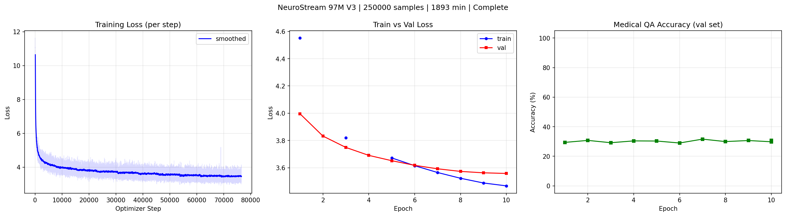
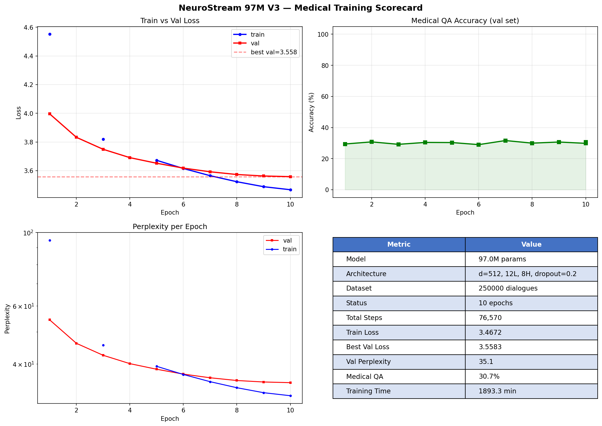
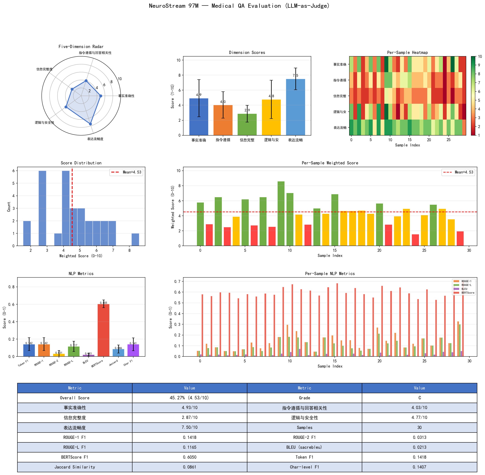

 c  # NeuroStream

**以记忆为核心的 AI 训练框架 — 边推理边学习**

*A memory-centric AI framework that learns while it infers*


---

## Table of Contents / 目录

- [English Summary](#english-summary)
- [核心理念](#核心理念--core-philosophy)
- [系统架构](#系统架构--architecture)
- [核心特性](#核心特性--features)
- [安装](#安装--installation)
- [快速上手](#快速上手--quick-start)
- [训练实验](#训练实验--experiments)
- [配置参考](#配置参考--configuration)
- [项目结构](#项目结构--project-structure)
- [测试](#测试--testing)
- [文档](#文档--documentation)
- [路线图](#路线图--roadmap)
- [贡献](#贡献--contributing)
- [致谢](#致谢--acknowledgments)
- [License](#license)

---

## English Summary

NeuroStream is a **memory-centric AI training framework** fundamentally different from traditional deep learning:

- **Memory as first-class citizen** — not Tensor + autograd, but Memory + MemoryPool
- **Shadow weights** — model weights actually change via EMA synchronization, not RAG-style retrieval
- **Dual-process architecture** — inference (fast, read-only) + learning (slow, write), fully decoupled
- **Memory-conditioned Transformer** — GPT-style decoder with cross-attention that fuses retrieved memories into generation
- **Biological metaphor** — cortex (fast thinking / inference) + hippocampus (slow thinking / consolidation)

```python
from neurostream import NeuroStreamPipeline

with NeuroStreamPipeline(dim=128) as pipe:
    pipe.ingest_many(["Cats are mammals", "Earth orbits the Sun"])
    pipe.wait(3.0)
    pipe.shutdown(save_path="memories.json")
```

Validated on **250K medical dialogues** (97M params, val perplexity=42.1). See [experiment report](docs/experiments/medical_v3.md).

---

## 核心理念 / Core Philosophy

NeuroStream 从根本上不同于传统深度学习框架：

| | 传统框架 (PyTorch/TF) | NeuroStream |
|---|---|---|
| **核心抽象** | Tensor + autograd | Memory + MemoryPool |
| **学习方式** | 离线批量训练 | 边推理边学习，实时持续 |
| **权重更新** | 集中式反向传播 | 影子权重 EMA 跨进程同步 |
| **知识存储** | 隐式编码在参数中 | 显式记忆池 + 参数协同 |
| **生物隐喻** | — | 皮层 (推理) + 海马体 (固化) |

**核心差异化**：影子权重机制让模型权重真正在变化，而非 RAG 式检索 — 知识被内化到参数中。

---

## 系统架构 / Architecture

```
                    NeuroStreamPipeline / Trainer
                              |
                       NeuroStreamEngine
                              |
                    ┌─────────┴─────────┐
                    |                   |
              推理进程              学习进程
            (Inference)           (Learning)
            ├─ Encoder             ├─ ShortTermBuffer
            ├─ MemoryProjector     ├─ MemoryPool (FAISS)
            ├─ Recall/Search       ├─ TimeIntegralConsolidation
            ├─ Transformer         ├─ ShadowWeightManager
            │  Decoder             ├─ TransformerTrainer
            └─ ToolRegistry        └─ ForgettingStrategy
                    |                   |
                    └── SharedWeightBuffer ──┘
                      (torch.share_memory_ + EMA)
```

**双进程模型**：推理和学习完全解耦，通过共享内存异步同步权重。推理进程始终保持低延迟响应，学习进程在后台持续训练。

详细架构文档：[docs/architecture.md](docs/architecture.md)

---

## 核心特性 / Features

- **可插拔编码器** — FeatureHash (零依赖) / SBERT / CLIP / Whisper / 自定义
- **分层记忆存储** — Hot (FAISS, sub-ms) / Warm (NumPy, ~ms) / Cold (磁盘)，自动晋升降级
- **影子权重同步** — MemoryProjector (残差 MLP, zero-init) + EMA 跨进程拉取
- **抗灾难性遗忘** — EWC (弹性权重固化) + Experience Replay (蓄水池采样)
- **反馈机制** — Memory.reward [-1, 1] 评分 + reward 加权对比学习 + LLM/人工评估
- **Transformer 解码器** — 记忆增强 GPT-style 生成，交叉注意力融合记忆上下文
- **工具系统** — Tool ABC + Registry + Calculator / PythonExec / HTTP + MCP 协议
- **Agent 闭环** — LLM Teacher 蒸馏训练 + 4 维基准评测 + Matplotlib 论文风格报表
- **GPU/CUDA** — 自动设备检测，计算在 GPU，通信在 CPU
- **懒加载** — 所有可选依赖按需导入，未安装时零影响

---

## 安装 / Installation

```bash
# 核心 (torch + faiss + numpy)
pip install -e .

# 语义文本编码
pip install -e ".[sbert]"

# Transformer 解码器 (需要 tiktoken)
pip install -e ".[decoder]"

# Agent 闭环训练 (DashScope + Matplotlib)
pip install -e ".[agent]"

# 全模态编码 (SBERT + CLIP + Whisper)
pip install -e ".[pretrained]"

# 完整安装
pip install -e ".[full]"
```

---

## 快速上手 / Quick Start

### 开发者 — 5 行上手

```python
from neurostream import NeuroStreamPipeline

with NeuroStreamPipeline(dim=128) as pipe:
    pipe.ingest_many(["猫是一种哺乳动物", "地球绕太阳公转", "水的化学式是H2O"])
    pipe.wait(3.0)
    pipe.shutdown(save_path="memories.json")
```

### 研究者 — 完全可控

```python
from neurostream import NeuroStreamTrainer, NeuroStreamConfig, MemoryProjector
from neurostream.forgetting import EWC

config = NeuroStreamConfig(
    dim=128,
    shadow_ema_alpha=0.005,
    ewc_lambda=500.0,
    decoder_enabled=True,
)
trainer = NeuroStreamTrainer(
    config=config,
    projector=MemoryProjector(dim=128, hidden=256),
    forgetting_strategy=EWC(lambda_=500.0),
)
trainer.start()

for entry in data_stream:
    trainer.ingest(entry["text"])

answer = trainer.generate("光速是多少?")
trainer.save_checkpoint("checkpoint.json")
```

### 预训练编码器

```python
from neurostream.encoder import UnifiedEncoder

# SBERT 语义编码 (384维 → 128维投射)
encoder = UnifiedEncoder.with_sbert(dim=128)

# 全模态 (文本 + 图像 + 音频)
encoder = UnifiedEncoder.full_multimodal(dim=256)
```

### Agent 蒸馏训练

```python
from neurostream import NeuroStreamPipeline
from neurostream.agent import AgentLoop, AgentLoopConfig, TeacherLLM

pipe = NeuroStreamPipeline(dim=128, shadow=True, decoder_enabled=True)

teacher = TeacherLLM(AgentLoopConfig(
    api_key="your-dashscope-key",
    model="qwen3-max",
))

loop = AgentLoop(engine=pipe._engine, teacher=teacher)
log = loop.run(dataset=training_data, num_epochs=3)

# 生成论文风格评测表
from neurostream.agent import BenchmarkReporter
reporter = BenchmarkReporter()
reporter.render_table(eval_results, output_path="benchmark.png")
```

### 工具调用

```python
pipe = NeuroStreamPipeline(dim=128, tools_enabled=True)
result = pipe.call_tool("calculator", {"expression": "sqrt(144) + pi"})
print(result.output)  # "15.141592653589793"
```

---

## 训练实验 / Experiments

### V3: 医学对话 (97M, 250K)

在 250K 真实医学对话上验证架构可行性。

| 指标 | 值 |
|------|-----|
| 模型 | 97.3M 参数 (d=512, 12L, 8H, ff=2048) |
| 数据 | 250,481 对话 (中文 80%, 英文 20%) |
| 训练 | 10 epochs, 69K 步, 23.8h on RTX 4060 |
| **Best Val Loss** | **3.740** |
| **Val Perplexity** | **42.1** |
| Train-Val Gap | 0.003 (无过拟合) |

**训练曲线**：



**训练记分卡**：



**LLM-as-Judge 医学问答评测**：



**生成示例**:

```
Q: 头痛发烧怎么办？
A: 建议做个头颅磁共振检查。

Q: 糖尿病患者饮食注意什么？
A: 多饮水，适当运动，多吃蔬菜水果

Q: 腰椎间盘突出怎么治疗？
A: 建议做腰椎核磁共振检查。
```

**同量级对比**:

| 模型 | 参数 | 训练数据 | Val PPL |
|------|------|---------|---------|
| **NeuroStream V3** | 97M | 250K 医学 (~50M tok) | 42.1 |
| GPT-2 Small | 117M | ~10B tokens (通用) | ~30-35 |
| OPT-125M | 125M | 180B tokens (通用) | ~27 |

> PPL 差距主要来自训练数据量差异 (200-6000x)，非架构缺陷。详见 [完整实验报告](docs/experiments/medical_v3.md)。

---

## 配置参考 / Configuration

`NeuroStreamConfig` 提供 30+ 可调参数：

| 参数 | 默认值 | 说明 |
|------|--------|------|
| `dim` | 128 | 向量维度 |
| `device` | "auto" | 设备 (auto/cpu/cuda) |
| `decay_rate` | 0.01 | 记忆强度衰减率 |
| `shadow_enabled` | True | 启用影子权重训练 |
| `shadow_ema_alpha` | 0.01 | EMA 同步系数 |
| `decoder_enabled` | False | 启用 Transformer 解码器 |
| `decoder_layers` | 6 | Transformer 层数 |
| `decoder_dim` | 256 | 模型维度 |
| `tools_enabled` | False | 启用工具系统 |

完整参数列表：[docs/api/config.md](docs/api/config.md)

---

## 项目结构 / Project Structure

```
neurostream/
├── types.py                 Memory / Modality / TierLevel
├── config.py                NeuroStreamConfig (30+ 参数)
├── encoder/                 可插拔多模态编码器
│   ├── text.py              FeatureHashEncoder (零依赖)
│   ├── sbert.py             SBERTEncoder (sentence-transformers)
│   ├── image.py             CLIPImageEncoder (open_clip)
│   ├── audio.py             WhisperAudioEncoder (openai-whisper)
│   └── unified.py           UnifiedEncoder (注册表 + 工厂方法)
├── memory/                  记忆管理
│   ├── buffer.py            ShortTermBuffer (线程安全)
│   ├── pool.py              MemoryPool (FAISS)
│   └── tiered.py            TieredMemoryPool (Hot/Warm/Cold)
├── consolidation/           可插拔固化策略
├── shadow/                  影子权重 (核心差异化)
│   ├── projector.py         MemoryProjector (残差 MLP, zero-init)
│   ├── sync.py              SharedWeightBuffer (share_memory_)
│   ├── objectives.py        ContrastiveLoss / RewardWeightedContrastiveLoss
│   └── manager.py           ShadowWeightManager
├── forgetting/              抗灾难性遗忘
│   ├── ewc.py               EWC (对角 Fisher)
│   └── replay.py            ExperienceReplay (蓄水池采样)
├── runtime/                 双进程运行时
│   ├── inference.py         推理进程
│   ├── learning.py          学习进程
│   └── engine.py            NeuroStreamEngine
├── feedback/                反馈系统
├── transformer/             Transformer 解码器
│   ├── model.py             MemoryConditionedTransformer
│   ├── generate.py          自回归生成 + 工具调用
│   └── train.py             TransformerTrainer
├── tools/                   工具系统
│   ├── builtin/             Calculator / PythonExec / HTTP
│   └── mcp/                 MCP 协议 (JSON-RPC 2.0)
├── agent/                   Agent 闭环训练
│   ├── teacher.py           TeacherLLM (DashScope)
│   ├── evaluator.py         BenchmarkEvaluator (4 维评测)
│   ├── report.py            BenchmarkReporter (Matplotlib)
│   └── loop.py              AgentLoop (Teacher→Student 蒸馏)
└── api/                     用户接口
    ├── pipeline.py          NeuroStreamPipeline (开发者)
    └── trainer.py           NeuroStreamTrainer (研究者)

tests/                       22 个测试文件, 253 个测试用例
docs/                        12 篇 Markdown 文档 + 实验报告
examples/
├── agent_demo.py            完整训练 + 交互演示
└── agent_training.py        LLM Teacher 蒸馏训练
```

---

## 测试 / Testing

```bash
pytest tests/ -v
# 253 passed in ~9s
```

22 个测试文件覆盖所有模块：类型系统、编码器、记忆管理、影子权重、固化策略、遗忘机制、反馈系统、Transformer 解码器、工具系统、Agent 闭环。包含线程安全并发测试、梯度流验证、确定性校验。

---

## 文档 / Documentation

| 文档 | 内容 |
|------|------|
| [docs/index.md](docs/index.md) | 项目总览 + 快速链接 |
| [docs/quickstart.md](docs/quickstart.md) | 5 分钟上手 (4 种场景) |
| [docs/architecture.md](docs/architecture.md) | 系统架构 + 设计哲学 |
| [docs/math_formulas.md](docs/math_formulas.md) | 数学公式汇总 (25 个核心公式) |
| [docs/api/config.md](docs/api/config.md) | 全参数参考 |
| [docs/api/encoder.md](docs/api/encoder.md) | 编码器体系 |
| [docs/api/memory.md](docs/api/memory.md) | 记忆管理 |
| [docs/api/shadow.md](docs/api/shadow.md) | 影子权重 |
| [docs/api/runtime.md](docs/api/runtime.md) | 双进程运行时 |
| [docs/api/pipeline.md](docs/api/pipeline.md) | Pipeline / Trainer API |
| [docs/experiments/medical_v3.md](docs/experiments/medical_v3.md) | V3 医学对话训练报告 |

---

## 依赖 / Dependencies

**必需 (3 个)**：

| 包 | 用途 |
|----|------|
| `torch>=2.0` | 神经网络框架 |
| `faiss-cpu>=1.7` | 向量相似度搜索 |
| `numpy>=1.24` | 数值计算 |

**可选**：

| 安装项 | 用途 | 包 |
|--------|------|----|
| `sbert` | 语义文本编码 | sentence-transformers |
| `clip` | 图像编码 | open-clip-torch, Pillow |
| `whisper` | 音频编码 | openai-whisper |
| `decoder` | Transformer 生成 | tiktoken |
| `agent` | Agent 训练 + 报表 | dashscope, matplotlib |
| `gpu` | GPU 监控 | pynvml |
| `dev` | 测试 | pytest |

---

## 路线图 / Roadmap

### v0.1.0 (当前)

- [x] 14 个开发阶段全部完成
- [x] 253 个测试通过
- [x] 97M 模型在 250K 医学对话上验证
- [x] 完整 API 文档

### 后续计划

- [ ] 升级架构组件 (RoPE 位置编码, SwiGLU FFN, RMSNorm)
- [ ] 扩展至 350M+ 模型，配合全量数据训练
- [ ] 集成记忆检索管线到训练循环（真正的记忆增强训练）
- [ ] 引入 BLEU/ROUGE/BERTScore 评测
- [ ] REST API 服务化
- [ ] 多 GPU 分布式训练支持

---

## 贡献 / Contributing

欢迎贡献！请阅读 [CONTRIBUTING.md](CONTRIBUTING.md) 了解开发环境搭建、代码规范和 PR 流程。

---

## 致谢 / Acknowledgments

- [MedDialog](https://github.com/UCSD-AI4H/Medical-Dialogue-System) — 医学对话数据集
- [HealthcareMagic](https://www.healthcaremagic.com/) — 英文医学对话数据
- [PyTorch](https://pytorch.org/) — 深度学习框架
- [FAISS](https://github.com/facebookresearch/faiss) — 向量相似度搜索
- [tiktoken](https://github.com/openai/tiktoken) — BPE 分词器

---

## License

[All Rights Reserved](LICENSE)
