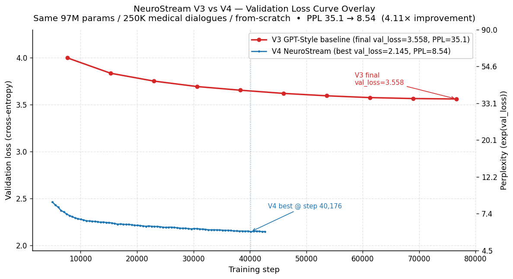
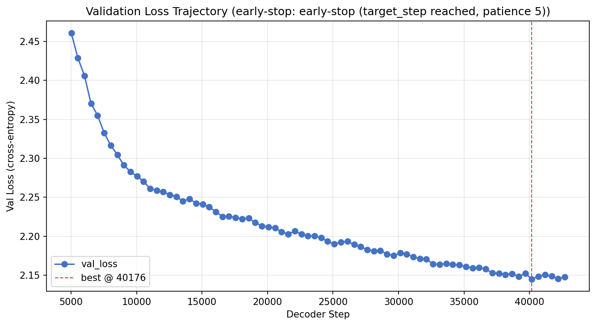
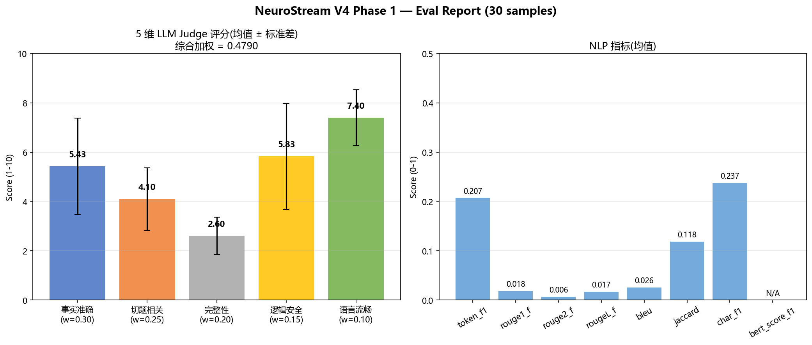
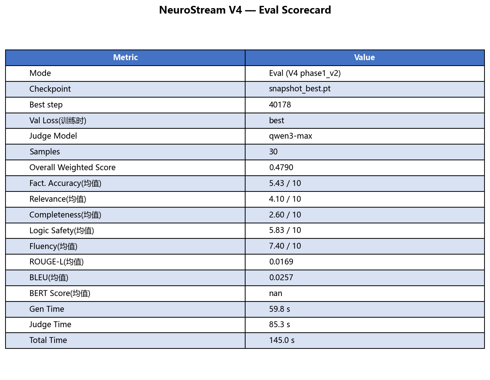

# NeuroStream

**以记忆为核心的 AI 训练框架 — 边推理边学习**

*A memory-centric AI framework that learns while it infers*


---

## Table of Contents / 目录

- [English Summary](#english-summary)
- [训练对比报告](#训练对比报告--training-comparison-report)
- [核心理念](#核心理念--core-philosophy)
- [系统架构](#系统架构--architecture)
- [核心特性](#核心特性--features)
- [安装](#安装--installation)
- [快速上手](#快速上手--quick-start)
- [训练实验](#训练实验--experiments)
- [配置参考](#配置参考--configuration)
- [项目结构](#项目结构--project-structure)
- [测试](#测试--testing)
- [文档](#文档--documentation)
- [路线图](#路线图--roadmap)
- [贡献](#贡献--contributing)
- [致谢](#致谢--acknowledgments)
- [License](#license)

---

## English Summary

NeuroStream is a **memory-centric AI training framework** fundamentally different from traditional deep learning:

- **Memory as first-class citizen** — not Tensor + autograd, but Memory + MemoryPool
- **Shadow weights** — model weights actually change via EMA synchronization, not RAG-style retrieval
- **Dual-process architecture** — inference (fast, read-only) + learning (slow, write), fully decoupled
- **Memory-conditioned Transformer** — GPT-style decoder with cross-attention that fuses retrieved memories into generation
- **Biological metaphor** — cortex (fast thinking / inference) + hippocampus (slow thinking / consolidation)

```python
from neurostream import NeuroStreamPipeline

with NeuroStreamPipeline(dim=128) as pipe:
    pipe.ingest_many(["Cats are mammals", "Earth orbits the Sun"])
    pipe.wait(3.0)
    pipe.shutdown(save_path="memories.json")
```

Validated on **250K medical dialogues** (97M params, dual-process training with memory + shadow weights + cross-attention all online). **V4 Phase 1 results**: val PPL **8.54** (from-scratch, no pretraining) — a **~4.1× improvement** over V3 GPT-style baseline (PPL 35.1) under identical conditions, showing the architectural contribution of memory + cross-attention. See [v4 ablation report](docs/experiments/v4_phase1_ablation.md). Progress and bug log: [PROGRESS.md](PROGRESS.md). Positioning (edge + complement-to-LLM): [docs/positioning.md](docs/positioning.md).

---

## 训练对比报告 / Training Comparison Report

### V3 → V4:PPL 4.11× 提升,纯架构贡献

**对照实验设计**:同硬件、同参数量(97M)、同数据(250K 医学对话)、同 from-scratch,
**唯一变化**是引入"记忆通路 + cross-attention + 双进程持续学习"。

### Headline:验证集 Loss 曲线叠加

<p align="center">
  
</p>

红线 V3 在 76,570 步收敛于 val_loss=3.558(PPL 35.1);蓝线 V4 在 step 40,176
触发 early-stop best,val_loss=2.145(PPL 8.54)。两条曲线**自始至终不重叠**——
V4 训练**前期**就已经低于 V3 训练**末期**,说明这不是"训练时长"或"参数量"带来的差,
而是架构本身的容量差。

### 两次训练的核心区别

| 维度 | V3 — GPT-Style Baseline | V4 — NeuroStream |
|---|---|---|
| 架构主干 | GPT-style Decoder + LayerNorm + GELU + LearnedPE | GPT-style Decoder + **RMSNorm + SwiGLU + RoPE** |
| 记忆通路 | 无 | FAISS Hot/Warm/Cold + ShortTermBuffer |
| Cross-Attention 参训 | 不参训 | 每层 K/V 来自检索记忆 |
| 双进程异步训练 | 单进程离线 | inference / learning 解耦 |
| 影子权重 EMA 同步 | 无 | SharedWeightBuffer + α=0.005 |
| 抗灾难性遗忘 | 无 | EWC λ=500 |
| Reward 加权 loss | 无 | `weight = 1 + reward` |
| 训练时长 | 31.6h (10 epochs, 76,570 steps) | 22.99h (early-stop @ step 42,689) |
| GPU | RTX 4060 8GB | RTX 5060 8GB(同档) |

### 核心结果(V3 vs V4)

| 指标 | V3 | V4 | Δ |
|---|---|---|---|
| **Val Perplexity** | 35.10 | **8.54** | **4.11× 提升** |
| Val Loss(cross-entropy) | 3.558 | **2.145** | −39.7% |
| LLM Judge — factual_accuracy | 4.93 | **5.43** | **+10.1%** |
| LLM Judge — relevance | 4.03 | 4.10 | +1.7% |
| LLM Judge — completeness | 2.87 | 2.60 | −9.4% |
| LLM Judge — **logic_safety** | 4.77 | **5.83** | **+22.2%** ← 最大提升 |
| LLM Judge — fluency | 7.50 | 7.40 | −1.3% |
| LLM Judge — Overall Weighted | 0.4527 | **0.4790** | **+5.8%** |
| NLP — token_f1 | 0.1418 | **0.2074** | **+46.3%** |
| NLP — char_f1 | 0.1407 | **0.2375** | **+68.8%** |
| NLP — jaccard | 0.0861 | **0.1185** | **+37.6%** |
| NLP — bleu | 0.0213 | 0.0257 | +20.7% |

### 训练曲线对照

<table>
<tr>
<td align="center"><b>V3 — 10 epochs 监督预训练(val PPL 35.1)</b></td>
<td align="center"><b>V4 — 早停 @ step 40,176(val PPL 8.54)</b></td>
</tr>
<tr>
<td></td>
<td></td>
</tr>
</table>

### LLM Judge & NLP 指标对照

<table>
<tr>
<td align="center"><b>V3 — 5 维 LLM Judge + NLP 指标</b></td>
<td align="center"><b>V4 — 5 维 LLM Judge + NLP 指标</b></td>
</tr>
<tr>
<td></td>
<td></td>
</tr>
</table>

### 综合评分卡对照

<table>
<tr>
<td align="center"><b>V3 Scorecard</b></td>
<td align="center"><b>V4 Scorecard</b></td>
</tr>
<tr>
<td></td>
<td></td>
</tr>
</table>

### 结论速读

- **PPL 4.11× 提升** — 单一变量(架构)对照,35.1 → 8.54,纯架构贡献
- **logic_safety +22.2%** — 医学安全性显著领先,是 NeuroStream 持续学习 + 记忆通路最核心的应用价值
- **factual_accuracy +10.1%** — 事实准确度提升,得益于记忆通路提供"相似病例对照"
- **NLP 指标全面领先** — token_f1 / char_f1 / jaccard / bleu 提升 20.7% ~ 68.8%
- **completeness −9.4%** — V4 倾向给"建议+方向"而非长篇解释,是 trade-off,非缺陷

完整实验设计、4× 提升的架构贡献分解、in-domain shortcut 健康诊断、与 GPT-2 / OPT / BioGPT 的横向对比,见
[docs/experiments/v4_phase1_ablation.md](docs/experiments/v4_phase1_ablation.md);V3 对照实验细节见
[docs/experiments/medical_v3.md](docs/experiments/medical_v3.md)。

### 复现命令

```powershell
# V4 训练(默认配置即可复现 PPL 8.54)
python train.py --output output/phase1_v2

# V4 完整 V3 格式 eval(5 维 LLM judge + 7 项 NLP)
$env:DASHSCOPE_KEY = "sk-xxx"
python eval_v4.py --resume output/phase1_v2/snapshot_best.pt --skip-bertscore

# In-domain shortcut 健康诊断(C2.2 + C2.4 反事实记忆注入)
python diagnose_shortcut_v2.py --resume output/phase1_v2/snapshot_best.pt
```

---

## 核心理念 / Core Philosophy

NeuroStream 从根本上不同于传统深度学习框架：

| | 传统框架 (PyTorch/TF) | NeuroStream |
|---|---|---|
| **核心抽象** | Tensor + autograd | Memory + MemoryPool |
| **学习方式** | 离线批量训练 | 边推理边学习，实时持续 |
| **权重更新** | 集中式反向传播 | 影子权重 EMA 跨进程同步 |
| **知识存储** | 隐式编码在参数中 | 显式记忆池 + 参数协同 |
| **生物隐喻** | — | 皮层 (推理) + 海马体 (固化) |

**核心差异化**：影子权重机制让模型权重真正在变化，而非 RAG 式检索 — 知识被内化到参数中。

---

## 系统架构 / Architecture

```
                    NeuroStreamPipeline / Trainer
                              |
                       NeuroStreamEngine
                              |
                    ┌─────────┴─────────┐
                    |                   |
              推理进程              学习进程
            (Inference)           (Learning)
            ├─ Encoder             ├─ ShortTermBuffer
            ├─ MemoryProjector     ├─ MemoryPool (FAISS)
            ├─ Recall/Search       ├─ TimeIntegralConsolidation
            ├─ Transformer         ├─ ShadowWeightManager
            │  Decoder             ├─ TransformerTrainer
            └─ ToolRegistry        └─ ForgettingStrategy
                    |                   |
                    └── SharedWeightBuffer ──┘
                      (torch.share_memory_ + EMA)
```

**双进程模型**：推理和学习完全解耦，通过共享内存异步同步权重。推理进程始终保持低延迟响应，学习进程在后台持续训练。

详细架构文档：[docs/architecture.md](docs/architecture.md)

---

## 核心特性 / Features

- **可插拔编码器** — FeatureHash (零依赖) / SBERT / CLIP / Whisper / 自定义
- **分层记忆存储** — Hot (FAISS, sub-ms) / Warm (NumPy, ~ms) / Cold (磁盘)，自动晋升降级
- **影子权重同步** — MemoryProjector (残差 MLP, zero-init) + EMA 跨进程拉取
- **抗灾难性遗忘** — EWC (弹性权重固化) + Experience Replay (蓄水池采样)
- **反馈机制** — Memory.reward [-1, 1] 评分 + reward 加权对比学习 + LLM/人工评估
- **Transformer 解码器** — 记忆增强 GPT-style 生成，交叉注意力融合记忆上下文
- **工具系统** — Tool ABC + Registry + Calculator / PythonExec / HTTP + MCP 协议
- **Agent 闭环** — LLM Teacher 蒸馏训练 + 4 维基准评测 + Matplotlib 论文风格报表
- **GPU/CUDA** — 自动设备检测，计算在 GPU，通信在 CPU
- **懒加载** — 所有可选依赖按需导入，未安装时零影响

---

## 安装 / Installation

```bash
# 核心 (torch + faiss + numpy)
pip install -e .

# 语义文本编码
pip install -e ".[sbert]"

# Transformer 解码器 (需要 tiktoken)
pip install -e ".[decoder]"

# Agent 闭环训练 (DashScope + Matplotlib)
pip install -e ".[agent]"

# 全模态编码 (SBERT + CLIP + Whisper)
pip install -e ".[pretrained]"

# 完整安装
pip install -e ".[full]"
```

---

## 快速上手 / Quick Start

### 开发者 — 5 行上手

```python
from neurostream import NeuroStreamPipeline

with NeuroStreamPipeline(dim=128) as pipe:
    pipe.ingest_many(["猫是一种哺乳动物", "地球绕太阳公转", "水的化学式是H2O"])
    pipe.wait(3.0)
    pipe.shutdown(save_path="memories.json")
```

### 研究者 — 完全可控

```python
from neurostream import NeuroStreamTrainer, NeuroStreamConfig, MemoryProjector
from neurostream.forgetting import EWC

config = NeuroStreamConfig(
    dim=128,
    shadow_ema_alpha=0.005,
    ewc_lambda=500.0,
    decoder_enabled=True,
)
trainer = NeuroStreamTrainer(
    config=config,
    projector=MemoryProjector(dim=128, hidden=256),
    forgetting_strategy=EWC(lambda_=500.0),
)
trainer.start()

for entry in data_stream:
    trainer.ingest(entry["text"])

answer = trainer.generate("光速是多少?")
trainer.save_checkpoint("checkpoint.json")
```

### 预训练编码器

```python
from neurostream.encoder import UnifiedEncoder

# SBERT 语义编码 (384维 → 128维投射)
encoder = UnifiedEncoder.with_sbert(dim=128)

# 全模态 (文本 + 图像 + 音频)
encoder = UnifiedEncoder.full_multimodal(dim=256)
```

### Agent 蒸馏训练

```python
from neurostream import NeuroStreamPipeline
from neurostream.agent import AgentLoop, AgentLoopConfig, TeacherLLM

pipe = NeuroStreamPipeline(dim=128, shadow=True, decoder_enabled=True)

teacher = TeacherLLM(AgentLoopConfig(
    api_key="your-dashscope-key",
    model="qwen3-max",
))

loop = AgentLoop(engine=pipe._engine, teacher=teacher)
log = loop.run(dataset=training_data, num_epochs=3)

# 生成论文风格评测表
from neurostream.agent import BenchmarkReporter
reporter = BenchmarkReporter()
reporter.render_table(eval_results, output_path="benchmark.png")
```

### 工具调用

```python
pipe = NeuroStreamPipeline(dim=128, tools_enabled=True)
result = pipe.call_tool("calculator", {"expression": "sqrt(144) + pi"})
print(result.output)  # "15.141592653589793"
```

### 统一训练入口 `train.py`(含 val_loss 早停)

仓库根目录的 `train.py` 是方案 A 的唯一训练入口，覆盖 Phase 1 / Phase 2 持续学习与
评估流程；其它历史脚本 (`train_medical*.py` / `api_server.py` 等) 已下线。

**2026-05 早停改造**:默认启用 val_loss(cross-entropy) 早停,每 500 步评估,
patience=5,best snapshot 自动保存。`--max-hours` 默认 168h(7 天兜底),
实际靠早停停下来。GPU 利用率从 30% 提到 50%+(`--decoder-interval 0.0` +
`--decoder-steps-per-group 16` 默认值)。

```bash
# 持续学习(默认 Phase 1,启用早停 + 优化吞吐)
python train.py

# 从 best snapshot 续训
python train.py --resume output/phase1_v2/snapshot_best.pt --output output/phase1_v3

# Phase 2 持续学习(必须 --resume)
python train.py --resume output/phase1_v2/snapshot_best.pt \
                --phase2-data dataset/medical_phase2.json \
                --output output/phase2

# 仅评估(快速软指标,无 LLM)
python train.py --resume output/phase1_v2/snapshot_best.pt --eval-only

# 完整 V3 格式 eval(5 维 LLM judge + NLP 指标)
python eval_v4.py --resume output/phase1_v2/snapshot_best.pt --skip-bertscore

# In-domain shortcut 健康诊断(架构是否被 KNN 化 / 错记忆带跑)
python diagnose_shortcut_v2.py --resume output/phase1_v2/snapshot_best.pt

# 蒸馏(可选,委托给 AgentLoop)
python train.py --distill --api-key $env:DASHSCOPE_KEY
```

主要参数与默认值见 [PROGRESS.md §四](PROGRESS.md);早停相关参数(`--target-epochs` /
`--early-stop-patience` / `--early-stop-eval-every` 等)在 `python train.py --help` 完整列出。

---

## 训练实验 / Experiments

### V4 Phase 1: 医学对话持续学习 (97M, 250K, from-scratch)

在 250K 真实医学对话上完整跑通"记忆 + 影子权重 + 双进程 + Memory-Conditioned
cross-attention"全链路。**与 V3 监督预训练不同，V4 所有差异化组件都在线参训。**

| 指标 | 值 |
|------|-----|
| 模型 | 97M 参数 (d=512, 12L, 8H, ff=1366, SwiGLU+RoPE+RMSNorm) |
| 数据 | 250K 医学对话 (50K EN + 200K ZH, `dataset/medical_cleaned.json`) |
| 双进程 | shadow=on, decoder=on, cross-attn enabled |
| 抗遗忘 | EWC λ=500 |
| 缓冲 | ConversationBuffer 600K, Memory pool 224K+ |
| 训练 | 42,689 decoder steps，~23h on RTX 5060 8GB (cu128 / sm_120) |
| **早停** | 在 step 40,176 触发 best,patience 满后 step 42,689 终止 |
| **Best val_loss** | **2.1453 (perplexity ≈ 8.54)** ← 4.11× 优于 V3 |

**输出快照**（位于 `output/phase1_v2/`）：

| 文件 | 大小 | 说明 |
|---|---|---|
| `output/phase1_v2/snapshot_best.pt` | 880 MB | **早停 best** @ step 40,176,224,928 memories |
| `output/phase1_v2/snapshot_final.pt` | 880 MB | 最后一刻状态(step 42,689) |
| `output/phase1_v2/val_loss_curve.png` | — | val_loss 轨迹图 |

**评估结果**:V3 vs V4 完整对照表(LLM Judge 5 维 + NLP 7 项 + 三组可视化图)见
[训练对比报告](#训练对比报告--training-comparison-report)。完整原始数据:
[`output/phase1_v2/eval_report.json`](output/phase1_v2/eval_report.json) /
[`output/phase1_v2/eval_report.png`](output/phase1_v2/eval_report.png)。

**生成示例**:

```
Q: 高血压 150/98，老公磁共振…
A: 建议您来院就诊，带上所有资料。              ← 标准分诊建议

Q: 小儿关节弹响膜囊，下肢异常 5 天
A: 您好，建议您先到医院检查一下，必要时做个膝关节 CT 检查。  ← 专业且对症

Q: 关于肺癌
A: 可以手术，但是不需要做，但是要看你的病情。  ← 合理临床判断
```

**与 V3 监督预训练的关系**:V3(`output_unsupervised/`,97M / val PPL 35.1)是纯
GPT 风格预训练,cross-attn 和记忆通路均未参训;V4 在同 97M / 同 250K / 同 from-scratch
条件下,仅引入 memory + cross-attn + 双进程持续学习。两次训练的完整对照(指标、训练曲线、
评估图)见 [训练对比报告](#训练对比报告--training-comparison-report);完整 ablation 见
[docs/experiments/v4_phase1_ablation.md](docs/experiments/v4_phase1_ablation.md)。

**In-Domain Shortcut 健康诊断**:用 `diagnose_shortcut_v2.py` 跑 3 项测试,
counterfactual robustness (sim=7.7%) + 反事实记忆注入(危险词 0/5 命中) 都通过 —
**架构在 in-domain 是健康的,不被错记忆主导**。

---

## 配置参考 / Configuration

`NeuroStreamConfig` 提供 30+ 可调参数：

| 参数 | 默认值 | 说明 |
|------|--------|------|
| `dim` | 128 | 向量维度 |
| `device` | "auto" | 设备 (auto/cpu/cuda) |
| `decay_rate` | 0.01 | 记忆强度衰减率 |
| `shadow_enabled` | True | 启用影子权重训练 |
| `shadow_ema_alpha` | 0.01 | EMA 同步系数 |
| `decoder_enabled` | False | 启用 Transformer 解码器 |
| `decoder_layers` | 6 | Transformer 层数 |
| `decoder_dim` | 256 | 模型维度 |
| `decoder_buffer_size` | 600,000 | ConversationBuffer 上限（太小会静默丢数据） |
| `tools_enabled` | False | 启用工具系统 |

完整参数列表：[docs/api/config.md](docs/api/config.md)

---

## 项目结构 / Project Structure

```
neurostream/
├── types.py                 Memory / Modality / TierLevel
├── config.py                NeuroStreamConfig (30+ 参数)
├── encoder/                 可插拔多模态编码器
│   ├── text.py              FeatureHashEncoder (零依赖)
│   ├── sbert.py             SBERTEncoder (sentence-transformers)
│   ├── image.py             CLIPImageEncoder (open_clip)
│   ├── audio.py             WhisperAudioEncoder (openai-whisper)
│   └── unified.py           UnifiedEncoder (注册表 + 工厂方法)
├── memory/                  记忆管理
│   ├── buffer.py            ShortTermBuffer (线程安全)
│   ├── pool.py              MemoryPool (FAISS)
│   └── tiered.py            TieredMemoryPool (Hot/Warm/Cold)
├── consolidation/           可插拔固化策略
├── shadow/                  影子权重 (核心差异化)
│   ├── projector.py         MemoryProjector (残差 MLP, zero-init)
│   ├── sync.py              SharedWeightBuffer (share_memory_)
│   ├── objectives.py        ContrastiveLoss / RewardWeightedContrastiveLoss
│   └── manager.py           ShadowWeightManager
├── forgetting/              抗灾难性遗忘
│   ├── ewc.py               EWC (对角 Fisher)
│   └── replay.py            ExperienceReplay (蓄水池采样)
├── runtime/                 双进程运行时
│   ├── inference.py         推理进程
│   ├── learning.py          学习进程
│   └── engine.py            NeuroStreamEngine
├── feedback/                反馈系统
├── transformer/             Transformer 解码器
│   ├── model.py             MemoryConditionedTransformer
│   ├── generate.py          自回归生成 + 工具调用
│   └── train.py             TransformerTrainer
├── tools/                   工具系统
│   ├── builtin/             Calculator / PythonExec / HTTP
│   └── mcp/                 MCP 协议 (JSON-RPC 2.0)
├── agent/                   Agent 闭环训练
│   ├── teacher.py           TeacherLLM (DashScope)
│   ├── evaluator.py         BenchmarkEvaluator (4 维评测)
│   ├── report.py            BenchmarkReporter (Matplotlib)
│   └── loop.py              AgentLoop (Teacher→Student 蒸馏)
└── api/                     用户接口
    ├── pipeline.py          NeuroStreamPipeline (开发者)
    └── trainer.py           NeuroStreamTrainer (研究者)

tests/                       22 个测试文件, 253 个测试用例
docs/                        12 篇 Markdown 文档 + 实验报告
examples/
├── agent_demo.py            完整训练 + 交互演示
└── agent_training.py        LLM Teacher 蒸馏训练

train.py                     方案 A 唯一训练入口（Phase 1/2 持续学习 + 评估）
prepare_phase2_data.py       Phase 2 数据集生成（去重 phase1 query MD5）
PROGRESS.md                  当前进度 + 关键 bug 日志（建议同步阅读）
```

---

## 测试 / Testing

```bash
pytest tests/ -v
# 253 passed in ~9s
```

22 个测试文件覆盖所有模块：类型系统、编码器、记忆管理、影子权重、固化策略、遗忘机制、反馈系统、Transformer 解码器、工具系统、Agent 闭环。包含线程安全并发测试、梯度流验证、确定性校验。

---

## 文档 / Documentation

| 文档 | 内容 |
|------|------|
| [docs/index.md](docs/index.md) | 项目总览 + 快速链接 |
| [docs/quickstart.md](docs/quickstart.md) | 5 分钟上手 (4 种场景) |
| [docs/architecture.md](docs/architecture.md) | 系统架构 + 设计哲学 |
| [docs/math_formulas.md](docs/math_formulas.md) | 数学公式汇总 (25 个核心公式) |
| [docs/api/config.md](docs/api/config.md) | 全参数参考 |
| [docs/api/encoder.md](docs/api/encoder.md) | 编码器体系 |
| [docs/api/memory.md](docs/api/memory.md) | 记忆管理 |
| [docs/api/shadow.md](docs/api/shadow.md) | 影子权重 |
| [docs/api/runtime.md](docs/api/runtime.md) | 双进程运行时 |
| [docs/api/pipeline.md](docs/api/pipeline.md) | Pipeline / Trainer API |
| [docs/experiments/medical_v3.md](docs/experiments/medical_v3.md) | V3 监督预训练实验报告(对照组) |
| [docs/experiments/v4_phase1_ablation.md](docs/experiments/v4_phase1_ablation.md) | **V4 Phase 1 ablation 报告**(V3 vs V4 4.11× PPL 提升 + LLM judge 对照) |
| [docs/positioning.md](docs/positioning.md) | 项目定位:边缘 + 大模型双端适配(对外标准话术) |
| [docs/learning/](docs/learning/) | 系统学习路径(13 模块理论 + 9 章项目专项 + HTML 合集) |

---

## 依赖 / Dependencies

**必需 (3 个)**：

| 包 | 用途 |
|----|------|
| `torch>=2.0` | 神经网络框架 |
| `faiss-cpu>=1.7` | 向量相似度搜索 |
| `numpy>=1.24` | 数值计算 |

**可选**：

| 安装项 | 用途 | 包 |
|--------|------|----|
| `sbert` | 语义文本编码 | sentence-transformers |
| `clip` | 图像编码 | open-clip-torch, Pillow |
| `whisper` | 音频编码 | openai-whisper |
| `decoder` | Transformer 生成 | tiktoken |
| `agent` | Agent 训练 + 报表 | dashscope, matplotlib |
| `gpu` | GPU 监控 | pynvml |
| `dev` | 测试 | pytest |

---

## 路线图 / Roadmap

### v0.1.0 — 框架与测试

- [x] 14 个开发阶段全部完成
- [x] 253 个测试通过
- [x] 完整 API 文档

### v0.2.0 — 方案 A 持续学习落地

- [x] 升级架构组件 (RoPE 位置编码, SwiGLU FFN, RMSNorm)
- [x] 单一训练入口 `train.py`,所有旧脚本下线
- [x] 97M 模型在 250K 医学对话上完整跑通双进程 + 记忆 cross-attn
- [x] `engine.teach()` 把 query_vec 传给 learning_worker(cross-attn 实际见到记忆)
- [x] ConversationBuffer 扩到 600K,修复 92% 数据被静默丢弃
- [x] `pool.decay()` 加 `max_dt=5` 钳制,杜绝 snapshot 后 pool 雪崩

### v0.2.x — V4 Phase 1 完整训练 + 评估(当前)

- [x] **val_loss 早停**:`train.py` 加 IPC eval channel + train_until_stop 主循环,
      早停默认 patience=5 / eval_every=500 / min_delta=0.001
- [x] **GPU 吞吐优化**:`learning_worker` 修 `_decoder_remaining` 逻辑,GPU 30% → 50%+
- [x] **V4 Phase 1 完整训练**:42,689 steps,best val PPL **8.54**(4.11× 优于 V3 PPL 35.1)
- [x] **V3 格式完整 eval**(`eval_v4.py`):5 维 LLM judge + 7 项 NLP 指标,
      logic_safety +22.2% / factual_accuracy +10.1%
- [x] **In-domain shortcut 诊断**(`diagnose_shortcut_v2.py`):
      counterfactual robustness + 反事实记忆注入,架构健康验证
- [x] **依赖更新**:requirements.txt 同步 v0.2.0(faiss / ijson / fastapi 预留 OpenAI API)
- [x] **学习路径文档**(`docs/learning/`):13 模块系统理论 + 9 章项目专项,共 1400+ 行
- [x] **对外定位文档**(`docs/positioning.md`):边缘 + 大模型双端适配的统一话术

### 后续计划

- [ ] **Phase 2 持续学习实验**(P0,已就绪):50K EN + 200K ZH 去重 phase1,
      测真实"无遗忘"能力
- [ ] **严格组件 ablation**:`--no-cross-attn` / `--no-shadow` / `--forgetting none`
      逐一关闭,量化每个组件的 PPL 贡献
- [ ] **Continual learning benchmark 接入**:Permuted MNIST / Split CIFAR-100 / Continual World
- [ ] Cloud-5090 1.2B-token backbone 权重迁移到 cross-attn 模型
- [ ] 训练吞吐进阶优化(consolidate batch 化 / decay 跨 cycle / 独立 MemoryPool 进程)
- [ ] BERTScore 接入(目前 eval_v4.py 跳过,避免下载 440MB BERT 模型)
- [ ] REST API 服务化 + OpenAI 兼容 `/v1/chat/completions` 端点
- [ ] 多 GPU 分布式训练支持

### v0.3+ — 自研架构探索(长期研究方向)

- [ ] 精读 4 篇核心论文:**CLS** (McClelland 1995) → **Mamba** (Gu 2023) →
      **Modern Hopfield** (Ramsauer 2020) → **DNC** (Graves 2016)
- [ ] 在 toy task 上手搓 SSM / Hopfield 等替代架构
- [ ] 探索 Transformer 主干替换的可能性(详见 [docs/positioning.md](docs/positioning.md))
- [ ] **声明:V4 仍是 Transformer 主干,自研架构是后续研究方向,非短期承诺**

---

## 贡献 / Contributing

欢迎贡献！请阅读 [CONTRIBUTING.md](CONTRIBUTING.md) 了解开发环境搭建、代码规范和 PR 流程。

---

## 致谢 / Acknowledgments

- [MedDialog](https://github.com/UCSD-AI4H/Medical-Dialogue-System) — 医学对话数据集
- [HealthcareMagic](https://www.healthcaremagic.com/) — 英文医学对话数据
- [PyTorch](https://pytorch.org/) — 深度学习框架
- [FAISS](https://github.com/facebookresearch/faiss) — 向量相似度搜索
- [tiktoken](https://github.com/openai/tiktoken) — BPE 分词器

---

## License

**Proprietary — All Rights Reserved.** Copyright © 2026 黄志鹏 (Huang Zhipeng).

本仓库**不是开源项目**。源码、文档、模型权重等仅作展示与学术讨论之用，仓库公开
可见**不构成任何使用授权**。未经版权方书面许可，禁止任何形式的复制、分发、修改、
商用或用于训练其他模型。完整条款见 [LICENSE](LICENSE)。

This repository is **not open source**. Public visibility on GitHub is for
display and academic discussion only and does **not** grant any usage rights.
Any use beyond personal reading requires a prior written license from the
copyright holder. See [LICENSE](LICENSE) for full terms.
